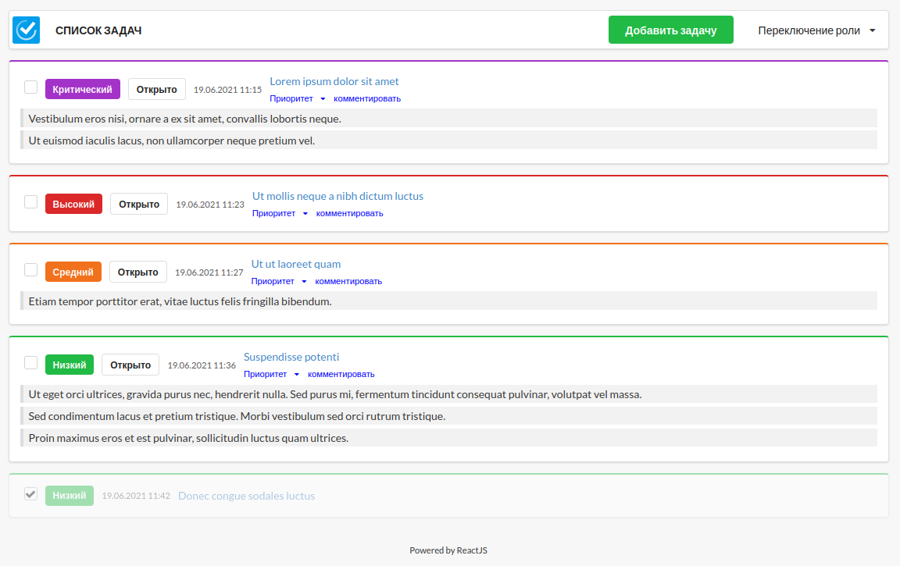
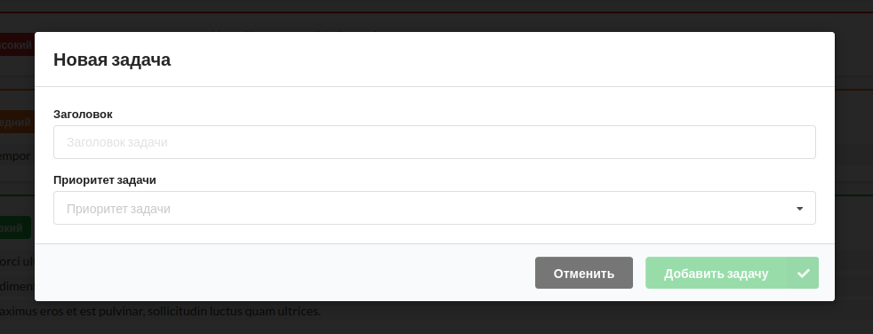

Example task manager interface 
===============

User Assignments interface. The general view of the interface is a heading with a button for switching the current role and a button for adding a new task. 



##### List of job attributes 
- date added;
- priority;
- the task;
- comment;
- status (open / closed);
- action (with buttons leave a comment, mark as completed / removed). 



The task list has the ability to change the priority. The form for adding a new task is implemented in the form of a dialog box and contains a title, a priority selection selector. 

Written in ReactJS + Redux (use Node and NPM). To debug an application on a local server, you must first install the necessary dependencies:
  * `npm install` Installing dependencies.
  * `npm update` Update all dependencies.
  * `npm start` Launches a local webserver for debugging the application.
  * `npm run build` Compiles applications for deployment.
  
  ##### Localstorage 
  All data of user tasks after the first launch of the project is placed in local storage. Any manipulations - adding a comment, a new task or changing the priority, make changes to the data stored in the device browser. 
  
  
  ```javascript
const tasks = [
    {
        id: 1,
        priority: 'critical',
        open: true,
        date: '19.06.2021 11:15',
        subject: 'Lorem ipsum dolor sit amet',
        comments: [
            'Vestibulum eros nisi, ornare a ex sit amet, convallis lobortis neque.',
            'Ut euismod iaculis lacus, non ullamcorper neque pretium vel.'
        ]
    }
]
  ```